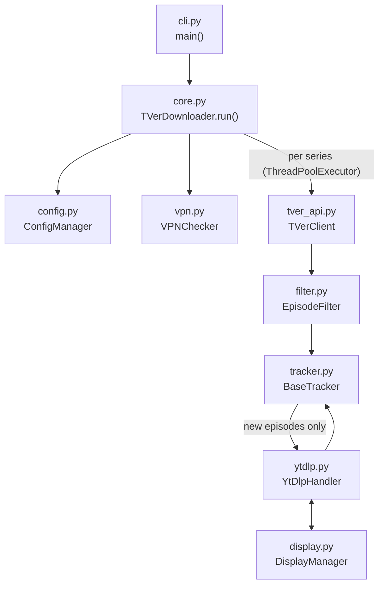
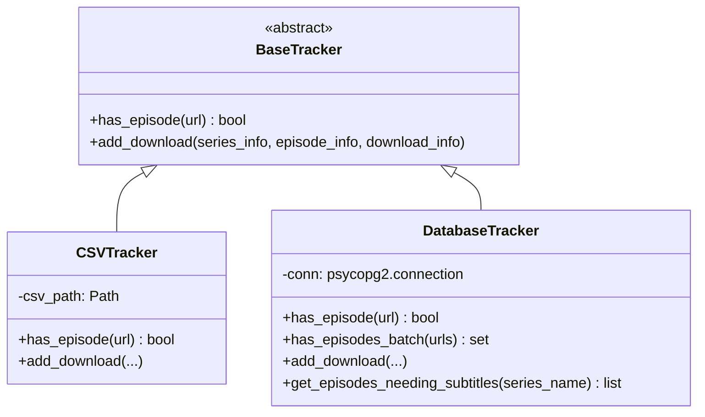

# Architecture

tver-dl is a Python CLI that polls the TVer API, filters episodes, deduplicates against a tracker, and downloads via yt-dlp.

## Download Pipeline

**Steps per series:**

1. Extract series ID from URL
2. Fetch seasons → fetch episodes from TVer API
3. Filter by `target_seasons`, `include_patterns`, `exclude_patterns`
4. Deduplicate against tracker history (batch lookup if DB)
5. Download via yt-dlp subprocess
6. Record result in tracker

## Module Overview

| Module | Class | Responsibility |
|--------|-------|----------------|
| `cli.py` | — | Argument parsing, entry point |
| `core.py` | `TVerDownloader` | Orchestrates full pipeline, manages concurrency |
| `config.py` | `ConfigManager` | YAML loading, env var expansion, series normalization |
| `tver_api.py` | `TVerClient` | TVer API: session init, series/season/episode fetch |
| `filter.py` | `EpisodeFilter` | Season + pattern filtering logic |
| `tracker.py` | `BaseTracker` | Abstract tracker interface + CSV and DB implementations |
| `ytdlp.py` | `YtDlpHandler` | yt-dlp subprocess management + result parsing |
| `display.py` | `DisplayManager` | Rich progress bars and log output |
| `vpn.py` | `VPNChecker` | Parallel IP geolocation checks (3 services) |
| `utils.py` | — | `traverse_obj` for safe nested dict access |

## Tracker Implementations

`DatabaseTracker` adds:
- `has_episodes_batch()` — single query to deduplicate a full series at once
- `get_episodes_needing_subtitles()` — finds downloaded episodes with missing subtitle files

## Key Design Decisions

**urllib3 instead of requests in `tver_api.py`** — the TVer API client uses urllib3 + certifi directly to avoid requests overhead and handle SSL CA quirks consistently.

**yt-dlp as subprocess** — `YtDlpHandler` shells out rather than using the yt-dlp Python API. It parses `--print after_move:RESULT:...` from stdout to capture output file paths reliably.

**Concurrency model** — `ThreadPoolExecutor` (default 3 workers) processes series in parallel. All workers share a single Rich progress display protected by a lock.

**Config normalization** — `ConfigManager` normalizes both list and categorized series formats into the same internal shape, so `core.py` never has to branch on format.
